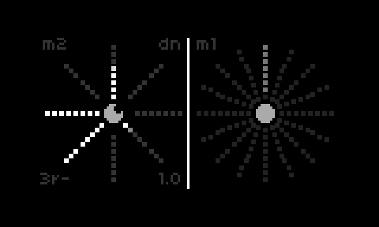
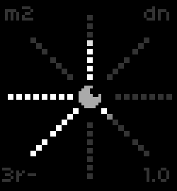
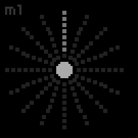

Although musical out of the box, the kinesis script was written for the 2025 habitus workshops and is meant to be tinkered with by folks with a beginning to intermediate level of norns-scripting  experience...for example, folks who have completed the [norns studies](https://monome.org/docs/norns/studies/) but aren't quite ready to create a whole script from scratch.

The notes below cover installation, quick start (for making sounds) and some ideas for modifying the script.

Also, extensive comments have been added to the code that help explain how it works and provide suggestions for further modification/exploration. Look for the robot guy in the code (-- [[ 0_0 ]] --) that indicates ideas for modification.

# Installation

* `;install https://github.com/jaseknighter/kinesis`
* Restart norns 
* Load the script

# Quick start

The interface uses the metaphor of the sun, its rays and photons. The script provides two suns that can operate in different modes.

By default:

* The left sun is set to granulate audio from norns input (using a new SuperCollider engine called `sunshine`)
* The right sun processes audio with softcut

## Sun 1: granulate audio

On load, the sunshine engine immediately starts granulating the norns' audio input. each ray controls a different grain synth param (aka "engine command"). You can also granulate pre-recorded audio (see below for details.)

This granular synth engine uses SuperCollider's [GrainBuf](https://doc.sccode.org/Classes/GrainBuf.html) UGen. GrainBuf granulates audio using sound stored in a [buffer](https://doc.sccode.org/Classes/Buffer.html).

K1+E2: switch between grain synth params.

The name of the grain synth param and its value are shown on the screen to the right of the sun at the top and bottom. The param names are abbreviated:

* "sp": `engine.speed` (the rate of the grain synth's playhead.default: 1)
* "dn": `engine.density` (the rate of grain generation. default: 1 grain per second)
* "ps": `engine.pos` (the playhead's position in the buffer)
* "sz": `engine.size` (the size of the granulated sample taken from the buffer. default: 0.1)
* "jt": `engine.jitter` (causes the playhead to randomly jump within the buffer. default: 0)
* "ge": `engine.env_shape` (the shape of the grain envelope...see below for details. default: 6)
* "rl": `engine.rec_level` (the amount of new audio recording into the buffer. default: 1)
* "pl": `engine.pre_level` (the amount of existing audio to be retained the buffer. default: 0)
<!-- * "we": `engine.buf_win_end` (size of the window that can be granulated. default: 1) -->

### Grain envelopes
The ray controlling the grain envelopes (`ge`), switches between six engelope shapes:
* Exponential (ray value: 1.0)
* Squared (ray value: 2.0)
* Linear (ray value: 3.0)
* Sine (ray value: 4.0)
* Cubed (ray value: 5.0)
* Welch (ray value: 6.0)

Note: exponential envelopes are the most percussive.

### Record and play engine command modulations
* Select a param (using K1+E2)
* Press K2 to start recording (notice the `-` changes to `+`)
* Turn E2 to record some param changes
* Press K2 to end recording (notice the `+` changes back to `-`) 

### Erase engine command modulations
* Press K2 twice to clear the recording of the selected engine command

### Freeze grains
* Let the grains emit for about 10 seconds to fill the recording buffer
* Set speed (sp) to 0
* Set pre-record level to 1 (pl)
* Set record level to 0 (rl)
* Change the position param (ps) to scrub the play head 

Alternatively, use the `freeze grains` trigger in the params menu. 

### Reset grain phase
The `reset grain phase` trigger in the params menu regenerates the supercollider grain player. It is meant to be used to sync the beat of the grains with other music (e.g. when playing in an ensemble.)

### Switch from "live" to "recorded" mode to play an audio file
* Select an audio file with the `sample` param file selector
* Set mode to `recorded` with the `set mode` param

## Sun 2: audio mangling with softcut

By default, the 2nd sun is configured to switch the softcut rate between 1 and 2. It is triggered when the lighted photon arrives at every other ray.

To start softcut rate switching, turn E3 until you see the sun pulsating. The velocity at which you turn E3 gets translated into the speed at which the softcut rate switches between 1 and 2.

To stop rate switching, turn E3 in the opposite direction.

## Switching sun modes
K1 + K2: switch the mode of the sun 1
K1 + K3: switch the mode of the sun 2

Each sun can operate in one of four modes

* Mode 1
  * Sound behavior: softcut rate switching
  * UI behavior: turning E2 or E3 moves photons around the sun
* Mode 2 
  * Sound behavior: live/recorded granular synthesis
  * UI behavior: the movement of photons in each ray controls the value of the SuperCollider engine command mapped to the ray
* Mode 3
  * Sound behavior: nothing by default. up to you to define
  * UI behavior: encoders activate one or more photon(s) moving around its sun
* Mode 4
  * Sound behavior: nothing by default. up to you to define
  * UI behavior: same as mode 1

# Modifying and exploring the script

## About the code
Conceptually, and as mentioned above, the script is made up two "suns" and each sun operates independently in one of four modes:

The code is organized hierarchically like so:

* kinesis.lua: the main file for the script (containing the `init` function norns will run when the script is first loaded.)
  * sun.lua: sets the visual elements of the sun (e.g., number of rays) and handles the switching between the different modes (see the `Sun:enc` function)
  * sun_mode_X.lua: the ui and sound behavior is defined in these four files
  * ray.lua: code for setting the size and position of each of the sun's rays.
  * photon.lua: code for each of the sun's "photons."  
* Engine_sunshine.sc: SuperCollider granular synth engine.
* utilities.lua: misc lua functions used by multiple files.

## Things to keep in mind while modifying the script
* Reload the script after making each of the modifications below. also, changes to SuperCollider code require restarting the norns.
* Try to only make one change at a time, reloading the script after every change. That way if something isn't working, it is easier to revert back to the last known working state.

## Simple modifications/explorations
### kinesis.lua
* Change the value of the `sun_modes` variable in the kinesis.lua file so the suns start in with a different mode (use values `1`,`2`,`3`, or `4`) 
* Uncomment the print statements in the `key` and `enc` functions, then restart the script and observe the values in the [REPL](https://monome.org/docs/norns/maiden/#repl) that are printed when pressing a key or turning an encoder.
  * Add an if/then statement around the print statement for the `enc` function so it only prints when enc 1 is turned.
### sun.lua
* Change the number of rays (`NUM_RAYS`)
* Change the number of photons per ray (`PHOTONS_PER_RAY`)
* Change the sun radius (`SUN_RADIUS`)
* Change some other values that have a robot (-- [[ 0_0 ]] --) indicator next to them and see what difference it makes.
### sun_mode_1.lua (softcut)
* Softcut rate
  * Find the code at the bottom of the sun_mode_1.lua file that changes softcut rate and modify the values.
* Other things to try:
  * `softcut.position(2,0)`
  * `softcut.rate_slew_time (2,5)`
  * `softcut.rec_level (2,0.5);softcut.pre_level(2,0.5)`
  * `softcut.loop_end(2,1)`

### sun_mode_2.lua (sunshine granular synth, lua code)
* Engine initialization
  * Find the `init_engine_commands` function
  * Change the default value for `engine.density`
  * Change the default values for other engine commands
  * Replace one of the commands in the engine_commands table with the `engine.buf_win_end` command
* Change default grain mode from live to recorded
  * Find the comment in sun_mode_2.lua "switch to granulate an audio file by default"
  * Uncomment the two lines that set the `sample` and `grain_mode` params
  * Be sure to add a file path to a file on your norns (see the note in the code)
* Add code to stop and restart a recording without erasing it

### sun_mode_3.lua
* With K1+K3: switch the 2nd sun to mode 3
* Photon velocity
  * In the REPL, run `suns[2]:set_velocity_manual(1)`
  * What happens when different values are passed to the function (e.g., `suns[2]:set_velocity_manual(-10)`)?
  * Review the `set_velocity_manual` function in sun.lua to understand how it works
  * Review the `sign` function in utilities.lua to understand how it gets used by `set_velocity_manual`.
* Active photons
  * Play with the `active_photons` variable. what happens if the initial values are changed? what happens if there are fewer or additional values in the `active_photons` table?
* Callbacks
  * Uncomment the print statements in the `sun_mode_3.photon_changed` and `sun_mode_3.ray_changed` functions. Restart the script and move the photons around with E3 to understand the conditions when these print statements trigger?
## Intermediate/advanced modifications/explorations
### sun_mode_.lua (softcut)
### Understanding the code better 
There are a number of print statements throughout the code that have been commented out. try uncommenting some of them and try to understand the data being printed (e.g. what is the data used for in the code?)